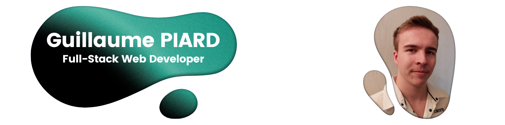

<!-- HEADER -->

 
  
  
   
  <!-- LINKEDIN -->
  <a href="https://linkedin.com/in/piard-guillaume" target="_blank">
    
    <!---->
  </a>
  <!-- MAIL -->
  
  <!-- PORTFOLIO -->
  <a href="https://guillaume-piard.fr/" target="_blank">
    
    <!---->
  </a>

<!--  -->
<!--
 
  
👨‍💻 All you need to know about me -> <a href="https://guillaume-piard.fr/">https://guillaume-piard.fr/</a>

-->

<!--
 
  
  
  
  

-->

<!--
 
  
  
  

-->

<h2 align="center">Skills: </h2>

    

        

            <h4>Languages</h4>
            
            
            
            
            
            
        

        

            <h4>Frameworks & Tools</h4>
            
            
            <!---->
            
            
            
            
        

    

<!--

    <table>
        <tr>
            <td>
                <h4>Languages</h4>
                
                
                
                
                
                
            </td>
            <td>
                <h4>Backend</h4>
                
                
                
            </td>
        </tr>
        <tr>
            <td>
                <h4>Frameworks</h4>
                
                
                
                
            </td>
            <td>
                <h4>Practices</h4>
                
            </td>
        </tr>
    </table>

-->

<!--
  
  
  
  
  
  
  
   

  
  
  
  
   

  
  
   

  
  
  <!-- 
  -->
  <!-- -->
<!--
-->
<!--
  
  
  
  
  
  
  
  
  
  
  
  
  

 -->

<h2 align="center">🎧 Music is the fuel that powers my coding! 🎧</h2>

 
  
  <!---->

<h2 align="center">Stats: </h2>

 
  
  
  <!-- -->
   
   

<!-- PROFILE VIEWS -->
 
